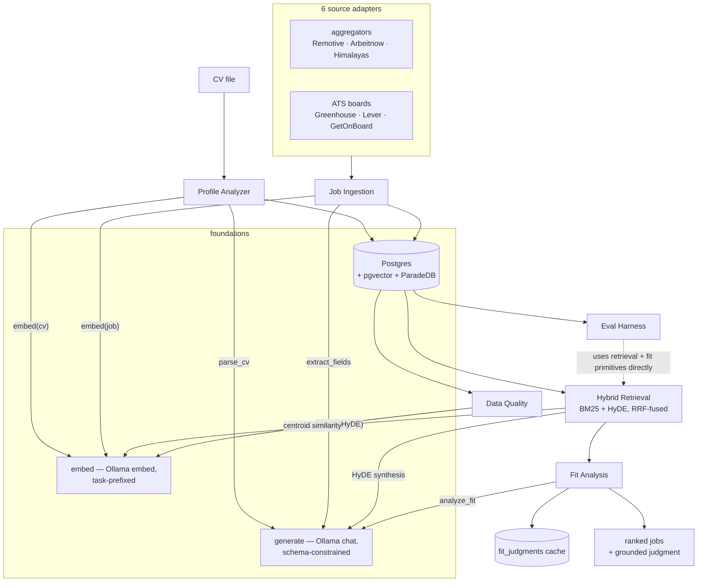

# Job Radar — Component Reference

> Written as the analysis pass ahead of restructuring the project. Every component below was
> read in full (not summarized from memory) as of 2026-08-16 — this reflects the code as it
> stands, including the uncommitted fit-cache work (see [docs/STATUS.md](STATUS.md) §1.3).
> Companion docs: [STATUS.md](STATUS.md) (what's built vs. planned, roadmap position) and
> [DESIGN.md](../DESIGN.md) (north-star architecture, not updated since commit 1).

## How data actually flows today

Two boxes are load-bearing across almost everything: **`generate()`** and **`embed()`**. Every
LLM-touching component in the codebase funnels through exactly these two functions — nothing
talks to Ollama directly. That's `DESIGN.md` §18's "adapters/ is the sole external-I/O seam"
holding up in practice, not just on paper.

---

## Foundations

### Configuration — `config.py`

`Settings(BaseSettings)`, `pydantic-settings`, loaded from `.env`. Fields: `database_url`,
`ollama_base_url`, `embedding_model`, `generation_model`, plus two optional per-purpose
overrides that fall back to `generation_model` when unset: `extraction_model` (ingest-time field
extraction — a simple task, a smaller/faster model is fine) and `fit_model` (fit analysis — the
dominant cost of a run, worth pointing at a stronger or specifically-evaluated model
independently of everything else). One module-level `settings` singleton, imported everywhere.

### Persistence — `db/base.py`, `db/models.py`

SQLAlchemy 2.0, fully async (`create_async_engine` + `async_sessionmaker`,
`expire_on_commit=False`). Postgres with two extensions doing real work: **pgvector** (`Vector`
columns, cosine distance) and **ParadeDB `pg_search`** (BM25 via a `jobs @@@ paradedb.parse(...)`
predicate — see Retrieval below). Alembic manages migrations.

Four tables:

| Table | Purpose | Notable columns |
|---|---|---|
| `jobs` | One row per deduplicated posting | `embedding` (768-dim), `requirements`/`responsibilities` (LLM-extracted at ingest, *not* the raw description — this is what BM25 actually indexes), `seniority` (normalized once at ingest, read everywhere downstream), `content_hash` (unique — cross-source dedup key) |
| `profile` | Singleton — the one stored candidate | `cv_embedding`, `dense_query_cache` (see note below), `domains_keywords` (JSON: `{tech_stack, domains}`), `location_rules`/`seniority_rules` (JSON preference rules) |
| `fit_judgments` (`FitJudgmentCache`) | Persisted LLM judgments, uncommitted work | 5-column unique key: `(profile_id, job_id, content_hash, model, prompt_version)` — the key *is* the invalidation policy |
| `eval_labels` (`EvalLabel`) | Human/LLM-assigned TREC-style relevance grades | `label` stored as a string "0"–"3" |

**Worth knowing before restructuring:** `Profile.dense_query_cache` is written (invalidated to
`None`) on every CV reload in `profile/loader.py`, but the only *read* site in the whole codebase
is `tests/test_eval_gate.py` — it lets the CI golden-regression test reuse a fixed, pre-written
HyDE posting text instead of calling a live LLM on every CI run. Production `fit/pipeline.py`
never reads it; it always regenerates 3 fresh HyDE samples per run. Not dead code, but a
narrow, CI-only purpose that isn't obvious from the column name alone.

### Generation adapter — `adapters/generation.py`

A hand-rolled async `httpx` client against Ollama's `/api/chat`, not a LangChain/LangGraph model
object (see [STATUS.md](STATUS.md) §5.1 for why that matters going into the agent work). One
function: `generate(prompt, schema: type[ModelT], *, model=None) -> ModelT`. Forces
schema-constrained JSON output (`format=schema.model_json_schema()`), `temperature=0`,
`num_ctx=8192` (sized from measured p90 fit-prompt token counts — smaller silently truncated the
CV+profile off the *front* of long prompts). Detects truncation explicitly
(`done_reason == "length"` → `TruncatedGeneration`) rather than letting it surface as a confusing
JSON-parse error. Logs call metadata only — prompt content is never logged (PII discipline).

Four call sites, three independent model slots: `profile/parse.py` (CV → `StructuredProfile`,
`generation_model`), `ingest/extract.py` (posting → requirements/responsibilities,
`extraction_model`), `fit/pipeline.py` (HyDE posting synthesis, `generation_model`),
`fit/analyze.py` (posting+profile → `FitJudgment`, `fit_model`).

### Embedding adapter — `adapters/embeddings.py`

Same shape, against `/api/embed`. One function: `embed(text, *, task: "query"|"document")`.
Prefixes the text with `search_query:`/`search_document:` per nomic-embed-text's contrastive
training contract — the model card marks this required for asymmetric retrieval, and skipping it
silently degrades quality rather than erroring. `num_ctx=8192` for the same truncation reason as
above. Four call sites: ingest (job embedding, `document`), profile loader (CV embedding,
`document`), fit pipeline (HyDE postings, `document`), quality module (anchor phrases + job
similarity, `query`).

### Source adapters — `adapters/sources/`

Contract (`base.py`): `SourceAdapter.fetch() -> list[dict]` (raw) +
`SourceAdapter.map(raw) -> NormalizedJob` (a fixed 14-field dataclass). Every one of the 6
adapters implements only these two methods — nothing else in the ingestion pipeline knows a
specific source exists.

Two source shapes in practice:
- **Aggregators** (`source_type="aggregator"`) — Remotive, Arbeitnow, Himalayas. One API call
  returns many companies' postings pre-mixed.
- **ATS boards** (`source_type="board"`) — Greenhouse, Lever, GetOnBoard. Direct per-company API,
  company list discovered dynamically.

Shared helpers, not per-adapter code:
- `normalize.py::html_to_text` — BeautifulSoup strip. `parse_salary` — regex-based, handles
  `$`/`€`/`£`, both thousands-grouping conventions (`50,000` and `68.000`), k-suffixes, and
  floors out figures below \$1,000 (an hourly rate or a stray decimal) rather than fabricating a
  plausible-looking but wrong annual number.
- `discovery.py::get_tokens` — shared ATS-board-token discovery used by Greenhouse et al.: pulls
  a community dataset (company→ATS-link mapping) filtered to `tech` industry, regex-extracts
  tokens, verifies each is live with a lightweight request, caches to `data/*.json` with graceful
  fallback to the last-good cache if discovery itself fails.

Concrete example (Greenhouse): filters to remote-only at `fetch()` time, unescapes HTML content,
and parses salary from *only* the `.pay-range` CSS element (not the full description) to avoid
picking up benefits/bonus figures.

---

## CV / Profile Analyzer — `profile/`

**Purpose:** turn one CV file into the single stored `Profile` row that grounds every downstream
query and judgment.

**Entry point:** `job-radar-profile` → `loader.py::load_profile(session, path)`

**Flow:**
1. `extract.py::extract_text` — `.txt`/`.md` pass through as-is; `.pdf` via **pdfplumber**
   (`x_tolerance=1`, tightened from the library default because the default merges adjacent
   glyphs with no explicit space — "Python,Kotlin" → glyph soup — which corrupts both the LLM
   parse and the embedding). Raises on an empty/image-only PDF rather than silently continuing
   with nothing.
2. `parse.py::parse_cv` — one schema-constrained `generate()` call → `StructuredProfile`
   (full_name/email flagged PII-local-only in the schema itself; `seniority` one of the 6-level
   ladder or null; `domains` is the one field the prompt explicitly permits inference on, from
   employer/project context, everything else must be stated verbatim in the CV;
   `work_history[].highlights` quoted, not paraphrased).
3. `embed(text, task="document")` — whole-CV embedding.
4. `loader.py` upserts the singleton `Profile`: CV-derived fields are overwritten on every
   reload; preference fields (`salary_floor`, `remote_required`, `location_rules`, `links`) are
   defaulted only on first creation and preserved thereafter, since a CV doesn't state them;
   `dense_query_cache` is explicitly invalidated on every reload.

**Depends on:** generation adapter, embedding adapter, `retrieval.seniority.normalize_level`.

---

## Job Ingestion — `ingest/`

**Purpose:** pull postings from all 6 sources, dedupe (within *and* across sources), enrich, embed,
persist — fully at ingest time, so nothing downstream re-derives structure from raw text.

**Entry points:** `job-radar-ingest` (one-shot, all adapters) · `job-radar-scheduler`
(APScheduler, daily cron at 03:00, `misfire_grace_time=3h`, `coalesce=True`, `max_instances=1`).

**Flow** (`pipeline.py::run_ingestion`, invoked per-adapter by `runner.py::run_all_ingestion`):
1. `adapter.fetch()` + `adapter.map()` for every raw posting → `NormalizedJob`.
2. `dedup.py::content_hash` — sha256 of normalized `company|title|location`, independent of URL
   — this is the cross-source identity: the same role pulled from an aggregator and the
   company's own Greenhouse board collapses to one hash.
3. "Already seen" check against two keys, not one: `content_hash` **or** `url`. The URL check
   specifically covers "posting text changed, same URL" — without it, a re-run would re-embed
   the edited posting and then fail the URL-unique constraint on insert.
4. New postings processed concurrently (semaphore-capped at 20):
   `extract.py::extract_fields` (schema-constrained, truncated to 4,000 chars, uses
   `extraction_model`, degrades to empty strings on failure rather than aborting the posting) →
   embed (`title+requirements+responsibilities` when extraction succeeded, else
   `title+full description` as fallback) → `seniority.normalize_level(title)`.
5. Sequential insert, one `SAVEPOINT` per row (`session.begin_nested()`), so a single constraint
   violation skips only that posting.
6. `runner.py` isolates failures per-adapter — one source being down doesn't block the others.

**Depends on:** all 6 source adapters, generation adapter, embedding adapter, seniority module.

---

## Hybrid Retrieval — `retrieval/`

**Purpose:** rank the corpus against a query. Not its own CLI — consumed by `fit/pipeline.py`
(production) and `eval/qrels.py` (offline evaluation, which calls the arm primitives directly
rather than going through `search()` — see the note at the end of this section).

**Tech:** ParadeDB `pg_search` (BM25, Tantivy-backed, runs *inside* Postgres) for lexical;
pgvector cosine distance for dense; Reciprocal Rank Fusion in plain Python to combine.

- **`bm25.py::search_bm25`** — per-field boosted (`title^5 requirements^3 responsibilities^1`
  default), `paradedb.parse(..., lenient=true)` (tolerant of `C++`/`.NET`-style special chars
  that would otherwise throw a parse error), scored via `paradedb.score()`.
- **`vector.py::search_vector`** — plain pgvector cosine similarity. Used for the HyDE arm in
  production, and (only in `eval/`) for a CV arm that's ablated out of production.
- **`fusion.py::reciprocal_rank_fusion`** — rank-position only, not raw score:
  `weight / (k + rank)` per arm, `k=60` default, optional per-arm weight multipliers,
  deterministic tie-break on UUID string.
- **`seniority.py`** — canonical 6-level ladder (`intern`→`principal`), regex synonym
  normalization (whole-word, scanned high-to-low so "Senior Staff Engineer" resolves to
  `staff`), `default_allowed()` = candidate's level + one above when the profile sets no
  explicit rule.
- **`geo.py`** — two mirrored implementations of one policy (SQL `~*`/`\y` regex for the
  retrieval prefilter, Python `re`/`\b` for scoring-time gating in `fit/score.py`): the
  structured `location` field is authoritative when present; title/description prose is
  consulted only when `location` is empty. Keywords ≤2 chars (e.g. "br") only match the
  structured field, never prose, to avoid collisions with ordinary words.
- **`filters.py::build_profile_filter`** — combines geo + `remote_required` + seniority range +
  salary floor (never excludes on *missing* salary, only a known `salary_max` below the floor in
  a matching currency) + `max_age_days` into one SQL `WHERE` clause, applied inside the retrieval
  query itself (each arm's pool is already in-date/in-region, not filtered after the fact).
- **`search.py::search`** — orchestrates: runs whichever arms have input (lexical if the query is
  non-blank, HyDE if an embedding is given; the `profile_embedding`/CV-arm parameter exists in
  the signature but production never passes it), fuses, fetches full `Job` rows in fused order.

**The production "dense" arm is HyDE, and it lives in `fit/pipeline.py`, not here:** 3 concurrent
LLM-synthesized "employer voice" postings (schema-constrained, ≥60-word validator, temperature 0)
are each embedded and averaged. Averaging smooths single-sample token-sampling variance; the
employer-voice framing keeps the query vector in the same semantic region as indexed *document*
embeddings — the asymmetry problem HyDE specifically targets.

**Worth knowing before restructuring:** `eval/qrels.py::build_run` deliberately reimplements
`search()`'s arm-selection logic by calling `search_bm25`/`search_vector` directly, rather than
calling `search()` itself — intentional, so `k`/`pool`/`field_boosts` can vary per-experiment
independently of the production function's fixed signature, but it means the two code paths can
drift; a shared core would remove that risk if it becomes a real maintenance cost.

**Depends on:** embedding + generation adapters (HyDE), Postgres/ParadeDB/pgvector.

---

## Fit Analysis — `fit/`

**Purpose:** for one profile × one posting, produce a grounded, evidence-cited judgment and a
deterministic 0–100 score. The most substantial single component in the codebase.

**Entry point:** `job-radar-fit` → `pipeline.py::run_fit_pipeline`

**Flow:**
1. Build the lexical query (`build_lexical_query` — target_titles + tech_stack, deduplicated
   tokens) and the HyDE embedding (see Retrieval above).
2. `retrieval.search(..., weights=[2.0, 1.0])` — lexical weighted 2× HyDE. This is the one
   hardcoded non-default RRF weight in production, arrived at via the eval sweep.
3. Cache lookup — `cache.py::load` (uncommitted), keyed on
   `(profile_id, job_id, content_hash, model, prompt_version)`. A content-hash mismatch (posting
   edited since caching) or an unparseable stored row is treated as a miss, never a crash.
4. Cache misses analyzed concurrently (semaphore=12, matching Ollama's `OLLAMA_NUM_PARALLEL`) via
   `analyze.py::analyze_fit`:
   - **Pre-flight guard** (`_has_sufficient_input`) — skips the LLM call entirely (returns a
     fixed "insufficient input" assessment) when the profile has no tech_stack/work_history or
     the posting has no description.
   - **One schema-constrained call** → `FitJudgment`. Field order in the schema is deliberate:
     evidence quotes are generated *before* the kind/satisfaction classification, because
     constrained decoding emits fields in declaration order and judging-then-quoting measurably
     made the model harsher (more blanket "unmet" verdicts) — it had nothing to reason over yet
     when it committed to a label. The prompt explicitly excludes score and seniority from the
     LLM's job: both are "handled separately."
   - **`score.py::score_fit`** — pure deterministic arithmetic, zero LLM involvement. Region
     eligibility and seniority-in-range are non-compensatory knockout gates, checked in Python
     against structured `Job.seniority`/`profile.location_rules` — a failed gate caps the score
     at 20 and forces verdict `"none"` regardless of how strong everything else is. Otherwise a
     weighted sum over whichever dimensions have data — required (0.50), preferred (0.15),
     seniority (0.25, asymmetric distance-based subscore, harsher for under- than
     over-qualified), domain (0.10, dropped entirely if the profile declares no domains) —
     renormalized over the dimensions actually present. Verdict bands: ≥80 strong / ≥60
     moderate / ≥40 weak / else none.
5. Cache write for fresh judgments only — **never the score**. `FitJudgmentCache`'s own docstring
   states why: score/verdict/gates depend on runtime `--level` overrides and on `_WEIGHTS`/
   `_BANDS` constants that can change independently of the LLM's judgment; caching the derived
   number would silently serve a stale score across either kind of change.
6. Cache hits are *rescored*, not restored (`score_fit` is pure and cheap), then merged with
   fresh results and sorted best-first.

**Depends on:** retrieval (candidate generation), generation adapter, the fit-judgment cache table.

---

## Data Quality Assessment — `quality/`

**Purpose:** an operator tool, not a search feature — per-source ingest health and coverage.

**Entry point:** `job-radar-assess`

**Flow:**
1. `metrics.py::compute` — pure Python, no I/O. Per-source + `"ALL"`-aggregate rates: null/future
   publish dates, salary/currency/location/job_type presence, description length + short-desc
   rate + **residual-HTML-marker rate** (regex-detects leftover `<tag>`/`&entity;` — a direct
   signal that a specific adapter's HTML-stripping is broken), `salary_min > salary_max`
   invalidity rate, keyword-based dev-title rate.
2. `relevance.py::build_centroid` — embeds 10 fixed "canonical developer role" phrases with the
   *same* `embed()` ingest uses, averages into one reference vector in the same space as stored
   job embeddings.
3. `relevance.py::relevance_by_source` — per-source mean cosine similarity to that centroid and
   % above a threshold (default 0.5), computed **inside Postgres** via pgvector's distance
   operator — no embeddings pulled into Python.
4. `cli.py` merges both metric families into one console table and a timestamped JSON snapshot
   under `data/quality/` (point-in-time only — not persisted to any table).

**Depends on:** embedding adapter.

---

## Evaluation Harness — `eval/`

**Purpose:** measure retrieval quality against human-labeled ground truth, offline, TREC-style.
The largest subsystem by design-doc investment (see [STATUS.md](STATUS.md) §2 chronology).

**Entry points:** `job-radar-eval-label`, `job-radar-eval-run`, `job-radar-eval-sweep`

- **`label.py`** — interactive labeling CLI. Builds a **union pool** across three retrieval
  configs (hybrid, HyDE-only, keyword-only) specifically to reduce pool bias — labels shouldn't
  only reflect what one config's ranking happens to surface. `--auto-prelabel` seeds a suggested
  grade from `analyze_fit`'s verdict (human overrides freely); `--fully-auto` saves LLM grades
  with no human step (fast, noisier); `--review` re-walks existing labels standalone. Target:
  50–80 pairs/profile, ≥15 at grade≥2.
- **`qrels.py`** — the shared adapter layer. `load_qrels` (DB → `{job_id: 0-3 grade}`, accepting
  numeric-string or verdict-word label spellings). `SearchConfig` (arms/k/pool/bm25_pool/limit/
  weights/field_boosts — every retrieval knob is a first-class experiment parameter).
  `build_run` executes arms directly (see the Retrieval-section note above on why). Four named
  configs matching production: `HYBRID`, `HYBRID_PROD`, `HYDE_ONLY`, `KEYWORD_ONLY` — no
  `vector_only`/CV config exists live (see [STATUS.md](STATUS.md) §2.2 on the doc that still
  claims otherwise).
- **`metrics.py`** — pure functions: `ndcg` (exponential gain `2^grade-1`), `mrr`,
  `precision_at_k`/`recall_at_k` (graded by a relevance threshold), `bpref` (pool-bias-robust,
  added after the original M6 plan's metric set).
- **`run.py`** — evaluates all four named configs concurrently, cross-validates its own nDCG@10
  against the `ranx` library (warns if they diverge by >1e-3), writes a git-SHA-tagged JSON
  artifact to `eval/results/`.
- **`sweep.py`** — OAT (one-at-a-time) sweep across 5 dimensions (RRF k, arm weights, pool size,
  BM25 field boosts, query-construction variant), each varied against the others held at the
  production baseline; `ranx.compare()` significance testing is wired in but currently inert
  (needs ≥2 query topics; today there's one profile = one topic).

**Depends on:** retrieval primitives directly, fit (for auto-prelabeling), `ranx` (soft
dependency, degrades gracefully if not installed).

---

## Cross-cutting pattern worth preserving

Every LLM call site in this codebase follows the same shape: **Pydantic schema → `generate()` →
deterministic post-processing in plain Python.** Fit score, salary parsing, seniority
normalization — none of that arithmetic/logic is ever asked of the model; the model only ever
supplies grounded, schema-constrained judgments, and code does the math. This is the same
principle [STATUS.md](STATUS.md) §5.4 argues Critic's grounding check should follow, and it's
already proven out across four independent components (profile parsing, ingest extraction, fit
judgment, HyDE synthesis) rather than being a one-off design choice. Worth keeping explicit as a
constraint on whatever gets built next in `agents/`.
