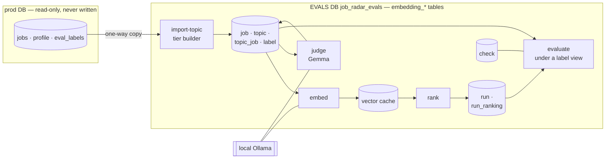

# Embedding-Model Evaluation — Design

> Status: **planned, not started.** A standalone harness that compares embedding models
> (incumbent `nomic-embed-text` vs `qwen3-embedding:0.6b` and `bge-m3`, all served by Ollama) on
> data extracted from production into a **separate EVALS database**. **Tier A** (the real
> profile) ships first; Tier B (synthetic personas) follows; Tier C is deferred. The harness is
> built so another tier, retrieval method, embedder, judge or metric is an addition, not a
> rewrite.
>
> How this is built, in order: [EMBEDDING_EVAL_IMPLEMENTATION_PLAN.md](EMBEDDING_EVAL_IMPLEMENTATION_PLAN.md)
> (Stage 1, with a phased parallel execution plan). This document is the *what and why*. It was
> independently reviewed against the real code, data and Ollama — see
> [EMBEDDING_EVAL_REVIEW_REPORT.md](EMBEDDING_EVAL_REVIEW_REPORT.md); `R-…` IDs below cite it.
>
> Relationship to other docs:
> - Builds on [EVAL.md](../EVAL.md) (grades, metrics) and reuses the pure functions in
>   `eval/metrics.py`. It is **not** part of the regression gate and does not replace
>   `just eval-run` — see §3.1 for the boundary.
> - Supersedes the earlier on-disk "bundle" design: data now lives in the EVALS database (§2.1).

---

## 0. Question, scope, and why the current eval can't answer it

Which embedder gives the best retrieval for this corpus (English-only postings) at acceptable
ingest cost?

**Scope principle: vary only the embedder; hold everything else fixed.** Only the dense
(similarity) ranking depends on the embedder, so that is the only thing this harness runs and
scores.

| Component | Depends on the embedder? | Treatment |
|---|---|---|
| Dense similarity ranking of jobs against the HyDE query vector | **Yes** | **Measured** |
| BM25 lexical arm | No — `search_bm25` never touches an embedding (F15) | **Not run, not measured** |
| RRF fusion | No — pure rank arithmetic | Not run |
| Profile hard filter (geo / remote / seniority / salary) | No | **Fixed input**: applied once at import to define the topic's candidate pool, exactly as production does |
| HyDE generation | No — an LLM step, not the embedder | **Fixed input**: texts frozen at import |
| Job `embed_text` — production's representation: title + LLM-extracted requirements / responsibilities (F20) | No | **Fixed input**: frozen at import and rebuilt exactly from stored columns (F3). *Which text to embed* is a separate axis (§3.3), not varied in the primary comparison |

"Only what the change touches" does not mean "no context": the filter and the frozen texts are
held constant so the *only* variable is the model.

Why the existing eval can't answer this:

| Property | Where | Effect on an embedder comparison |
|---|---|---|
| Measures a *system*, not a component | `eval/run.py` scores hybrid / hyde_only / keyword_only configs through prod Postgres | The embedder's effect is diluted by BM25 and fusion, and every run needs the full stack |
| Embedder is hard-wired | `embed()` reads `settings.embedding_model` with a nomic-only prefix map; `OllamaProvider.embed` hardcodes model and `num_ctx`; `search_vector` reads `Job.embedding` | A second model can't be pointed at without changing production code |
| Labels anchored to the incumbent | `label.py` pools from three configs whose vector arm is nomic | A challenger that surfaces unlabeled jobs is scored as wrong (pool bias, [EVAL.md](../EVAL.md)) |
| One real topic, saturated metric | `eval/golden/result.json`: nDCG@10 0.886, MRR / P@5 / P@10 all 1.0; the golden `qrels.json` holds 122 labels while the DB holds 221 (R-m9) | No headroom to detect a difference; the artifact is stale |

### 0.1 Facts verified against the live DB, code and Ollama (2026-09-18)

Measured, not assumed. Re-check any the design depends on if the corpus or models change.

| # | Fact | How established | Consequence |
|---|---|---|---|
| F1 | `search_vector` runs an exact `Seq Scan` + `Sort`; the two HNSW indexes from migration `1c79f1288961` are **unused** | `EXPLAIN` on the live query shape. `ORDER BY 1 - (embedding <=> q)` isn't the operator form the index needs | No ANN noise; offline exact cosine is the *same computation* as production's |
| F2 | **All** stored vectors carry the `search_document: ` prefix, early rows included | Re-embedded 24 random jobs (12 before the prefix commit `d8ebf84`, 12 from September): cos(stored, with prefix) = 1.0000, without ≈ 0.95 | Stored vectors are homogeneous — a valid baseline |
| F3 | `embed_text` is **exactly reconstructible** from DB columns | Same probe: cosine 1.0000 on both branches of the fallback | Level-2 parity (§3.4) is achievable |
| F4 | Ollama `/api/embed` returns **unit-norm** vectors | ‖v‖ = 1.0000 for stored and fresh | Re-normalizing is a no-op *except* after Matryoshka truncation, where it is required |
| F5 | Embedding is **deterministic** for fixed model + text | nomic: repeat calls are **bit-identical**. Qwen3 and bge-m3: cosine 0.99998939 / 0.99999915 (not bit-identical; review R-m9) | Caching is safe and makes a run reproducible; run-to-run variance (≤ 1e-5) isn't a confound |
| F6 | **788 clusters of byte-identical embeddings, 2,327 rows (14%)**, and `search_vector` has **no secondary sort key** | `GROUP BY embedding HAVING count(*) > 1` | Production's order among ties is non-deterministic → a strict "same order" parity gate is impossible (§3.4) |
| F7 | 1,145 duplicate clusters by normalized `(company, title)`, 3,337 rows | `GROUP BY lower(btrim(company)), lower(btrim(title))` | Reposts sit in Tier A's pool with correlated labels; relevant to slicing and to any future known-item tier |
| F8 | nomic throughput **~110 docs/s** at concurrency 8; the full 16k corpus ≈ 2.5 min | Timed 96 real texts (avg 1,309 chars) through the prod provider | Re-embedding a 1.4k pool per embedder is seconds |
| F9 | Ollama has `nomic-embed-text` (274 MB, F16, GGUF context 2048) and `Gemma3:12b` (12.2B, Q4_K_M) locally; `qwen3-embedding:0.6b` (639 MB, **Q8_0**, context 32,768) and `bge-m3:latest` (1.2 GB, **F16**, context 8,192) were pulled during review | `ollama list`, `ollama show`, `/api/tags` | Quantization differs across candidates (a confound to report); Stage 1 starts with `ollama pull` on a fresh machine |
| F10 | Tier A's candidate pool is **1,395 of 16,389 jobs** (mid, remote-required). 212 of the 221 labels fall inside it (against the LLM-made prod labels, not human) (grade 0: 56 · 1: 48 · 2: 72 · 3: 36); 9 fall outside the current filter. The 5 personas' pools are 4,534–10,477 each (union of all six: 11,568) | `build_profile_filter` over the live DB; label join | Tier A's pool is small enough to embed and LLM-label **completely**; the personas' pools are not (Tier B, §2.3) |
| F11 | The 221 prod labels read `human` but **were produced by the fit LLM, not a human** (user statement 2026-09-19); they are **NOT imported**, and no harness code treats them as human gold. (Earlier reading: [STATUS.md](../STATUS.md) §4 records a prior mixed state, 134 `llm-fully-auto` + 77 `human`, and `--labeled-by` defaults to `human` in every mode, so the column never distinguished the two.) Measured against Gemma: κ_w 0.481 over 44 pairs, exact 0.50, within-1 0.795, binary precision 0.76 / recall 0.73 | User statement; `label.py` argparse default; R-M10 in the review report | Gold is only `human_blind`, made by the user with the `label-blind` command (§2.4); the F10/F24/F26 numbers that used the prod labels are kept as history with that caveat |
| F12 | The prod provider hardcodes model + `num_ctx`, and logs `Context error: No active span…` per call outside a Langfuse span | Read `providers.py`; observed on every probe | Another reason the harness has its own Ollama client |
| F13 | Importing `job_radar.db.base` builds the engine from `settings` (required fields, no defaults), and `eval/run.py` imports it at module top | Read `db/base.py`, `config.py`, `eval/run.py` | Harness modules must not import `job_radar.*` or `eval.run`, except the few that read prod (§3.1) |
| F14 | Embeddings have consumers beyond the dense arm: `quality/cli.py:136` embeds anchor phrases with `task="query"` and `quality/relevance.py` compares them to `jobs.embedding` against a fixed 0.5 cosine threshold; `profile/loader.py:62` stores `cv_embedding` (no longer used by retrieval) | `grep` over `src/` | Not evaluated here; cosine scale is model-dependent, so the threshold needs re-calibration at cutover (§6) |
| F15 | The BM25 arm is embedder-independent | `bm25.py` has no reference to embeddings | Grounds the scope table |
| F16 | A prod connection opened with `-c default_transaction_read_only=on` **blocks CREATE, INSERT, DELETE, UPDATE and TRUNCATE** with `ReadOnlySqlTransaction`, and leaves prod untouched | Tested against the live DB with a probe table and empty-effect writes | "Never write prod" can be *enforced* by the connection, not promised (§2.1) |
| F17 | Postgres is `paradedb/paradedb:pg16` with `job_radar` as the (super)user, so it can `CREATE DATABASE` and `CREATE EXTENSION vector`; CI runs the same image. Prod migrations are one Alembic history (`alembic/`) whose `env.py` imports prod settings and models | `infra/docker-compose.yml`, `.github/workflows/ci.yml`, `alembic/env.py` | The EVALS database needs its own Alembic environment, and a compose init script wouldn't run on the existing volume — creation must be an idempotent command |
| F18 | **Gemma3:12b judging is feasible**: structured JSON output works (100/100 schema-valid in review); prompts ≈ 1,150 tokens zero-shot, ≈ 2,600 with 8 few-shot exemplars, ≈ 50 output tokens; **2.8 s/job** zero-shot sequential (author, median of 6), **2.55 s/job median sequential with few-shot** (review, n = 100, prefix cache working); the author's *0.55 jobs/s at concurrency 4* is **unverified** (review probe of 8 jobs, dominated by cold slots: 0.26 jobs/s) | Author spike + review sample | A full-pool labeling is ~1 h sequential; measure concurrency 1/2/4 at the WP9 gate; the prefix cache is visible in `prompt_eval_duration`, not `prompt_eval_count` |
| F19 | `build_hyde_embedding` **writes** `profile.dense_query_cache` and commits when texts are missing. The 428 cached fit judgments hold no grade (`domain` / `requirements` / `summary`; the verdict is derived later by scoring code) and only 89 rows (62 distinct jobs) overlap the human labels | Read `fit/pipeline.py`; `fit_judgments` schema | The import must only *read* cached HyDE texts; there are no free LLM labels to reuse |
| F20 | Production does **not** embed the raw description. `ingest/extract.py` first runs an LLM extraction (`settings.extraction_model`, `qwen2.5:3b` locally) over the **first 4,000 characters**, returning plain-prose `requirements` and `responsibilities` (company overview, benefits and perks excluded; a failure silently returns empty). `embed_text` = title + requirements + responsibilities — or, **only when both are empty**, title + the full description — then `search_document: ` + nomic. On the Tier-A pool: 1,378 of 1,395 (98.8%) use the extracted text and 17 the fallback; median description 3,017 chars → median `embed_text` 1,239 (median ratio 0.45, p10 0.16); **522 (37.4%) of the descriptions exceed 4,000 chars**, so the extractor never saw their tails (57.6% corpus-wide); 186 (13.3%) have only one of the two fields | Read `ingest/extract.py` and `ingest/pipeline.py::_prepare`; measured over the pool and the corpus | The harness embeds exactly this text as a **frozen input** (§0), rebuilt from stored columns (F3). The extraction's loss and noise sit upstream of the comparison: surfaced as slices (§3.5) and a risk (§7), not varied |
| F21 | Labels were graded on a **more clipped** view than any consumer sees. `label.py` has shown it since its first commit (2026-06-30): title, company, **source** (not location), seniority and the **extracted** requirements / responsibilities **truncated to 400 chars each** — the description only when both are empty. Production's fit judge (`fit/analyze.py::_posting_body`) reads the same fields **unclipped**, as do the embedders. In the pool 1,176 of 1,378 extracted-branch documents (85.3%) have a field longer than 400 chars; the median labeler saw 59% of the extracted text | Read `eval/label.py::_show_job`, `git log -S`, `fit/analyze.py`; measured over the pool (R-M3) | All 221 imported labels reflect the **label view** of a posting (§2.4). The judge must mirror it to be calibratable; a full-text view is a Stage-2 diagnostic |
| F22 | The dense query is the **mean embedding of `_HYDE_N = 3` LLM-written postings**, but generation runs at **temperature 0** (`providers.py`), so the three are not independent samples. Your cached three share their opening 157 characters, differ only in the tail (text similarity 0.46–0.79), sit at embedding cosine **0.96–0.99** from each other, and each is 0.987–0.996 from their mean | Read `fit/pipeline.py` and `providers.py`; measured on the real profile's `dense_query_cache` | Averaging smooths almost nothing: the Tier-A query is effectively **one vector**. Freezing it is right, but the whole comparison then rests on that single query (§7) |
| F23 | **Ollama's effective embedding context is not `num_ctx`.** `nomic-embed-text` (loaded ctx 2048) and `bge-m3` (loaded ctx 8192) both saturate `prompt_eval_count` at **2,048** for `num_ctx` 2048 / 8192 / 32768; `qwen3-embedding:0.6b` honors 8192 (2,661 tokens processed) and stops at 4,095 with no `num_ctx`. `"truncate": false` returns HTTP 400 `the input length exceeds the context length` for all three. On the pool, 1 document reaches 2,048 tokens (nomic, bge-m3), 0 for Qwen3; only ≈ 16 pool documents (≈ 1%) would exceed 2,048 tokens as full description | Probed `/api/embed` with texts of 300–30,000 words; `/api/ps`; embedded the whole pool with all three (R-M7) | A single `num_ctx` does **not** equalize truncation, and `prompt_eval_count ≥ num_ctx` can never detect it. Detect with `truncate=false` and store a per-vector `truncated` flag |
| F24 | **A single-shot Gemma judge is not yet calibrated.** 8 few-shot exemplars, the 400-char label view, 45 non-exemplar jobs labeled by the prod labels (against the LLM-made prod labels, not human): QWK **0.413**, exact 35.6%, within-1 80%, binary (≥ 2) precision 0.66 / recall 0.88; 8 of 9 human-grade-3 jobs graded 2; judge ≥ 2 rate 0.71 vs human 0.53 on the same jobs. A random 55-job pool sample: 47% ≥ 2 (±13) | Review probe (indicative, not prompt-tuned) | Below the proposed κ_w ≥ 0.6 — expected before iteration. Silver views need a **passed calibration** to be reportable |
| F25 | **The eligible pool is not "few relevant documents".** Estimated grade ≥ 2: ≈ 660 (475–844) by the over-rating judge, ≈ 430 after correcting for judge precision; humans rated 108 of the 212 labeled jobs ≥ 2 (51%) | Review probe (F24) | Recall@100 ≤ 100/R ≈ 0.15–0.23: it cannot be a headline. nDCG@100, P@100 and AP are (§3.5) |
| F26 | **The partial `human` view rewards coverage, not quality.** Unjudged = 0 over the 212 labels (against the LLM-made prod labels, not human): deliberately degraded nomic variants (no document prefix; MRL 64–256) scored *above* the incumbent (nDCG@100 0.261 vs 0.199; Recall@100 0.250 vs 0.194); judged@100 is only 0.26–0.34 for every embedder. Condensed to the 212 labeled documents, the paired-bootstrap SD of a difference vs the incumbent is ≈ 0.035–0.04 AP, 0.04–0.06 nDCG@50, 0.06–0.07 P@50 | Real vectors for all candidates + degraded variants, 212 labels, B = 2000 (R-M1, R-M9) | Partial views report **only** condensed metrics, bpref and judged@k. With ~212 documents, differences below ≈ 0.07–0.08 AP are noise |
| F27 | The candidates disagree a lot: top-100 sets overlap ~46–50 of 100 between nomic and Qwen3 / bge-m3; the union of the six variants' top-30 is **73 documents** (4 in all six). Each of the 3 HyDE texts alone reproduces 87–96 of the mean query's top-100 and the same embedder order (bge-m3 > qwen3-instruct > nomic on condensed AP) | Real vectors, same probe | The decision region is small enough to label blind in ~1 h (Stage 2); the 3-text query variation is harmless, a different query *recipe* is not tested by it |
| F28 | **`profile.cv_text` contains PII**: the full name, the email (equal to `profile.email`), a URL token and a phone-like number | Regex counts on the live profile, nothing printed (R-M6) | The snapshot must scrub `cv_text`; "no name, email or links" holds only for the structured fields |
| F29 | **Qwen3 end-of-text is handled by Ollama**: against fp32 `Qwen/Qwen3-Embedding-0.6B` with `<\|endoftext\|>` appended (the tokenizer's default) on 30 texts, cosine min 0.99938, mean 0.99956 (a no-EOS reference: mean 0.66) | HF reference vs Ollama (R resolved) | The runtime-fidelity diagnostic is answered; Qwen3 numbers are quality *as served* |
| F30 | The baseline suite is **322 passed, 1 failed** on a migrated empty database (`test_ndcg_meets_golden_threshold`, pre-existing); the repo's existing tests write to `DATABASE_URL` when run locally | `pytest -q` on a throwaway DB (R-M8) | Stage 1's gates read "no new failures"; new prod-facing tests use a throwaway database |

## 1. Decisions locked

| Decision | Choice | Why |
|---|---|---|
| Scope | **Dense-only.** No BM25, no RRF anywhere in the harness | §0: only the dense ranking depends on the embedder |
| Isolation | A **separate database `job_radar_evals`**, tables prefixed `embedding_`; prod is only ever *read*, through a read-only connection | F16; a separate database can't collide with prod names, migrations or data, and can be dropped and rebuilt |
| Shared DB | The EVALS database may host **other eval families** later; each owns a table prefix; one Alembic history for the whole database | The user's direction; avoids a second migration mechanism per eval |
| First deliverable | **Tier A only** (real profile), through Gemma silver labels and metrics | The user's direction; Tier B and cutover build on it |
| Corpus | **The whole eligible pool (1,395), never a sample and never selected by similarity** | Selection by any embedder's similarity biases toward it; a subsample distorts difficulty; embedding is cheap (F8) |
| Labels | **Complete silver labels** from an independent LLM judge (`Gemma3:12b`, a different family from the qwen2.5 HyDE generator), **reportable only after a passed calibration** against the user's ~50 blind labels (`human_blind`), then **blind human gold** where it changes the answer | §2.4; completeness removes pool bias and makes the collection reusable for any future embedder; the judge's agreement is unproven until calibrated (F24) |
| Human labeling | **Blind** — no LLM grade, no retrieval rank shown | Anchoring would defeat calibration (F11) |
| Metrics | **nDCG@100, P@100, AP** primary; nDCG@10, Recall@100 (always with its ceiling), bpref, judged@k secondary; partial views report condensed metrics only; every comparison carries a paired-bootstrap interval, negative controls and a query-sensitivity table | The pipeline passes 100 candidates to fit analysis and nDCG@10 is saturated; but R ≈ 430–660 makes Recall@100 ceiling-bound (F25) and the raw partial view is a coverage artifact (F26) |
| Extensibility | Tiers, ranking methods, embedders and judges are behind small protocols; label sources and metrics are constants/tables (§3.2). No registry exists until a second implementation does | Tier B must slot in without touching the core; CLAUDE.md forbids speculative abstraction |
| Candidates | `nomic-embed-text` (768-d, incumbent) · `qwen3-embedding:0.6b` (1024-d, MRL, instruction-aware) · `bge-m3` (1024-d) | English-only corpus, so bge-m3 is a strong non-instruction baseline, **not** picked for multilinguality |
| Variants | A small, **pre-declared** set (≤ 6). All are reported; none is selected on the data it is scored on | With one topic there is no held-out split; restraint is the guard against tuning to it |

**Prerequisite (F9):** `ollama pull qwen3-embedding:0.6b && ollama pull bge-m3`. Record each tag's
digest and quantization and the `ollama --version` with every run — quantization and runtime
version are confounds to report, not absorb.

## 2. The dataset

A test collection is **documents + topics + labels**, all stored in the EVALS database.

### 2.1 The EVALS database and the isolation rules

- Database `job_radar_evals` on the same Postgres server, reached through `EVALS_DATABASE_URL`.
  It has its own SQLAlchemy metadata and its own Alembic history (`alembic_evals/`); prod's
  `alembic/` is untouched. `pgvector` is enabled in it; vectors are stored as unconstrained
  `vector`, so embedders of any dimension coexist (no index — ranking is exact).
- **One-way import.** Production data flows into the EVALS database and never back. The prod
  session is opened with `default_transaction_read_only=on` and the code asserts
  `transaction_read_only = on` before it reads a row, so a bug fails loudly instead of writing
  (F16). This guards against **accidents**, not a deliberate `SET` (the override persists on a pooled
  connection — R-m4), hence a `NullPool` engine and before/after row counts. No prod table, row,
  migration, role or grant is created or changed.
- Only three modules may import `job_radar.*` — the prod reader, the Tier-A builder and the parity
  check — and only `db.models`, `retrieval.vector`, `retrieval.filters` and `ingest.embed_text`
  (which transitively load `job_radar.config`, requiring the four prod variables, and construct an
  unused read-write engine at import — F13). An AST test **and a subprocess import test** enforce the
  rest (§3.1, R-M5).
- The database is disposable **except its labels**, which are human effort. `labels export` /
  `import` (JSON under gitignored `data/`) is the backup path.

### 2.2 Tables

All prefixed `embedding_`, in `job_radar_evals`. Identity: a surrogate `id` per document snapshot, deterministic (`uuid5` of `origin`, `origin_id`,
`embed_text_sha`), so import is idempotent and a posting whose embedded text later changes becomes a
*new* document rather than silently altering an old one. Label and check rows carry a `BIGINT
IDENTITY` id so "latest" is unambiguous (`now()` is constant inside a transaction — R-M4). The exact
column list is the schema contract in the implementation plan §7.1.

| Table | Holds |
|---|---|
| `embedding_job` | Immutable document snapshot: `origin` (`prod` \| `authored`), `origin_id`, `source`, `title`, `company`, `url`, `location`, `remote`, `seniority`, `description`, `requirements`, `responsibilities`, `content_hash`, **`embed_text`** (frozen), **`embed_text_sha`**, `prod_embedding` (the production vector, for parity) |
| `embedding_topic` | One query-side unit: `tier`, unique `name`, `status` (`draft` → `frozen`), `profile_snapshot` (JSON), **`query_inputs`** (JSON, e.g. `{"hyde_texts": [...]}`), `builder`, notes. **Immutable once frozen**; a change means a new topic |
| `embedding_topic_job` | The topic's candidate corpus: (`topic_id`, `job_id`) |
| `embedding_label` | `topic_id`, `job_id`, `grade` (0–3, checked), **`source`** (`human_blind` \| `constructed` \| `llm_judge`), `judge_run_id`, `rationale`, `created_at`. **Append-only** — a re-label adds a row |
| `embedding_judge_run` | One judge pass: `model`, `model_digest`, `prompt_version`, `prompt_sha`, `params` (incl. the label-view clip constant), `fewshot` (exemplar ids + grades), counts, timings |
| `embedding_embedder` | Registry snapshot: `fingerprint` (backend + model digest + `num_ctx`), name, model, digest, quantization, runtime version, config |
| `embedding_vector` | The embedding cache: (`fingerprint`, `text_sha`) → native-dimension `vector`, `n_tokens`, **`truncated`**. `text_sha` is the sha256 of the **exact string sent** (prefix included), so it is topic-independent, identical strings dedupe across prefix configurations, and Matryoshka variants share it |
| `embedding_run` | One (method, topic) execution: `name`, `embedder_fingerprint`, `method_fingerprint`, `method_config` (JSON, carries the method kind), git sha, timings, docs/s, truncated-document count, status |
| `embedding_run_ranking` | The **full** ranking: (`run_id`, `job_id`, `rank`, `score`), unique on (`run_id`, `job_id`). Small (≈ 1.4k rows per run) and joinable with labels |
| `embedding_check` | Named checks per topic: `parity_ranking`, `parity_reconstruction`, `judge_calibration` (pinned to a `judge_run_id`), … → `passed`, `detail` (JSON), `created_at` |

Deliberately **not stored**: metrics. They are functions of *(ranking, labels)*, and labels
change as human labels arrive, so `evaluate` recomputes them on demand. A run is the expensive,
immutable part; evaluation is the cheap, repeatable part.

Not created until needed (added by later migrations): `embedding_label_task` (the blind-labeling
queue), the nullable `embedding_label.selection` and `.basis` columns (Stage 2: pooled / calibration /
retest buckets and the full-text label view), `embedding_topic_job.role` (Tier B distractors) and any
report snapshot table — each is a one-line migration when its consumer exists (R-m8).

### 2.3 Tiers

A **tier** is a recipe for building a topic: where its query inputs come from, how its corpus is
chosen, and which label sources apply. The core (embed → rank → evaluate) is tier-agnostic; a
tier is one `TopicBuilder` (§3.2).

**Tier A — the real profile (Stage 1).**

| Part | Content | Origin |
|---|---|---|
| Topic | The real candidate: mid, remote-required, targeting Software Engineer / Backend Developer / AI Infrastructure Engineer. `profile_snapshot` keeps the structured fields plus `cv_text` (the judge needs what a human labeler knows), **scrubbed** of the name, email, phone numbers and URLs it contains (F28) | Prod `profile` (read-only) |
| Query inputs | The 3 cached HyDE texts, frozen. The import **only reads** `dense_query_cache` and fails clearly if it is empty (F19) | Prod cache |
| Corpus | The eligible pool from `build_profile_filter` (and `embedding IS NOT NULL`, as production's `search_vector` requires): **1,395 jobs** | Prod `jobs` |
| Labels | **None imported** — the prod `eval_labels` were produced by the fit LLM, not a human (F11); the import reads only the prod table counts, to prove prod is untouched. Gold is ~50 `human_blind` labels made with `label-blind` (~30 pooled + ~20 random), then complete `llm_judge` labels (Stage 1), then more blind gold (Stage 2) | `label-blind` + new |

**Tier B — synthetic personas (Stage 3).** The five persona fixtures already in
`eval/personas/` (CV, ground truth, 20 authored jobs each, 5 per grade). Their real eligible
pools (4.5k–10.5k) are too large to label, so each persona gets a **closed corpus**: the 20
authored jobs plus ~200 distractors — half BM25 hits on the persona's stack (hard negatives,
chosen by a model outside the comparison), half random from the eligible pool. Labels:
`constructed` for the authored jobs; `llm_judge` for distractors, with the judge **calibrated on
the 100 authored jobs**, whose grades are known; humans spot-check only distractors the judge
rates ≥ 2. Because authored jobs go straight into the EVALS database, **nothing is injected into
prod's `jobs` table** — the earlier design's prod write disappears. Tier B measures
discrimination on hard cases with exact labels; it does not give production-like absolute scores.

**Tier C — known-item topics (deferred).** Synthetic profiles written for sampled postings,
positives by construction. Supplies sample size for paired statistics if a single profile proves
too narrow. Out of scope until Tier A and B are read.

### 2.4 Labels

Grades 0–3, exactly as in [EVAL.md](../EVAL.md) (strong / relevant / marginal / not relevant).

**Sources and precedence** (high → low). The *effective* label for a (topic, job) is the
highest-precedence source present; within a source, the latest row wins:
`human_blind` > `constructed` > `llm_judge`.
Named **views** select which sources count, so a claim can be checked under several:

| View | Sources | Complete? |
|---|---|---|
| `silver` | `llm_judge` only | Yes — every corpus job |
| `human` | `human_blind`, `constructed` | No — partial; refused with "no human labels yet — run `label-blind`" while empty |
| `effective` | all three, by precedence | Yes |

`silver` and `effective` are **pinned to one judge run** (`judge_run_id` is required), so a spike run or a new
prompt version can never silently mix into a comparison (R-M4).

**Label basis: the label view.** Grades are judged on the view the prod labeler showed (and `label-blind` now shows the user) — `label.py::_show_job` (F21): title, company, **source**, seniority and the **extracted**
requirements and responsibilities **clipped to 400 characters each** (the description clipped to 400
only when both are empty); **no location**. This is *more clipped* than what the fit stage and the
embedders read (85% of pool documents lose text in it; the median labeler saw 59% of the extracted
text), and it inherits the extractor's losses (F20). Mirroring it exactly is what makes a grade mean
the same thing across `llm_judge` and `human_blind`, and what lets the judge be
calibrated against the user's blind labels at all. The cost is that the eval measures embedders against
*that* view of relevance, so an embedder that exploits text the labelers never saw is penalized. A
full-text label set (~100 jobs graded on both views) is a Stage-2 diagnostic and is **required before
any full-text embedding variant is decision-grade**. The clip constant is recorded on every judge run.

**The judge (Stage 1).** `Gemma3:12b` locally via Ollama, structured output `{reason, grade}`
(reason first), temperature 0, fixed seed. A **different model family from the qwen2.5 that
generates the HyDE text**, so the labels aren't circular with the query side (Clarke & Dietz).
Design points:

- **Static prefix first** — rubric, candidate brief, few-shot examples, *then* the job — so
  Ollama can reuse the cached prefix across the ~1.4k calls (verified sequentially: prefix
  `prompt_eval_duration` 3.35 s → 0.24–0.45 s).
- **Few-shot:** 4 exemplars (1 per grade, `--fewshot-per-grade` to change) drawn, seeded, from the user's `human_blind` labels; recorded in
  `embedding_judge_run.fewshot` and **excluded from calibration**. Few-shot beat zero-shot, which
  varied widely, in the [patching study](https://arxiv.org/html/2405.04727v1).
- **The judge never sees** HyDE text, any retrieval rank or score, or any embedder output.
- **Prompt iteration is bounded and honest:** tuned on the `human_blind` labels (with only ≈ 50 of them, a held-out
  half is opt-in via `--held-out-half` and too small to be decisive), then `prompt_version` is frozen before the full run.
- **Calibration** (`embedding_check`): quadratic-weighted κ, exact and within-1 agreement,
  binary (≥ 2) precision/recall, confusion matrix, against the user's `human_blind` labels (all
  non-exemplar ones by default). Caveat: the ~30 pooled labels come from the embedders' top-30s, so
  this is *optimistic for the top of the ranking*; the ~20 random ones are the unbiased check. With
  ≈ 50 labels (46 after the exemplars) the κ_w standard error is ≈ 0.1, so the gate is coarse. **The gate (κ_w ≥ 0.6, proposed) is
  enforced**: `evaluate` refuses judge-based views without a passed `judge_calibration` for the
  pinned judge run (or stamps them `UNCALIBRATED`). A single-shot probe scored 0.41 (F24) — budget
  prompt rounds on the dev half, then switch model (a paid `Judge` behind the same protocol) rather
  than trust a poor judge.
- LLM judges over-rate, especially with lexical overlap
  ([arXiv 2602.17170](https://arxiv.org/html/2602.17170)), and are best at coarse relevant /
  not-relevant calls — which is why silver labels are never the only view.

**Blind human gold.** `label-blind` shows only the job (rubric, then the 400-char label view; no LLM
grade, no rank, no score, no run name) and records `human_blind`, committing after every label so a
session is resumable. **~50 of these (~30 pooled + ~20 random) are part of the first pass**, because
they are the only gold: they calibrate the judge and give the `human` view. Stage 2 extends them with
three buckets, each with a different job:

| Bucket (recorded in the Stage-2 `selection` column) | Which jobs | Purpose |
|---|---|---|
| `pooled` | Union of each embedder's top-30, not yet human-labeled, **disagreement-first** (in some but not all embedders' top-30) — on the real pool the union of the six variants' top-30 is **73 documents**, only 4 in all six (F27) | Decision region: exact metrics where the embedders differ. Grounded in Minimal Test Collections ([Carterette et al.](https://www.researchgate.net/publication/221299380_Minimal_test_collections_for_retrieval_evaluation)) |
| `calibration` | ~100 drawn **at random** from the unpooled remainder, stratified by silver grade; inclusion probabilities recorded | Estimates the judge's error and how many relevant jobs the pool missed. Must be random: the human sample behind prediction-powered guarantees has to be i.i.d. ([KDD'24](https://arxiv.org/html/2407.02464)) |
| `retest` | ~10–30 of the user's own blind labels, relabeled later | Your own label noise |

Expected effort ≈ 150–250 labels (about two hours) for a complete collection, versus a
200-job toy set for the same effort. Assessor disagreement rarely reorders systems
([Voorhees 2000](https://www.nist.gov/publications/variations-relevance-judgments-and-measurement-retrieval-effectiveness)),
though newer work questions that for neural-era collections.

## 3. The harness

### 3.1 Boundaries with existing workflows

| Aspect | This harness | Existing workflows |
|---|---|---|
| Trigger | Manual CLI `job-radar-eval-embedding` and `job-radar-evals-db`, plus `just` recipes | `just eval-run` / `eval-sweep` / `test` |
| CI | Never *runs the evaluation*. Its unit and integration **tests** run in CI against a throwaway EVALS database | Regression gate runs in CI |
| Needs to run | The EVALS database + a local Ollama. **No paid API, no internet (once models are pulled), no Langfuse.** Prod is needed only by `import-topic` and `verify` | Full stack |
| Question answered | *Which embedder ranks best?* (component) | *Does the whole retrieval system regress?* (system) |
| Production **code** touched | (1) `build_embed_text` extracted from `ingest/pipeline.py` — behavior-preserving, shared by ingest and the Tier-A import. (2) `eval/metrics.py` gains `average_precision` (pure). Nothing else | — |
| Production **data** touched | **None.** Read-only import; the guard is tested (F16) | — |
| Not touched | `OllamaProvider`, the `LLMProvider` Protocol, `embed()`, `search_vector`, ingest behavior, prod schema/migrations, `eval/label.py`, CI's regression gate | — |

Module isolation is enforced, not promised: (a) an AST test scans every module under
`eval/evals_db/` and `eval/embedding/` and fails if one outside the allow-list
(`evals_db/prod_reader.py`, `embedding/tiers/tier_a.py`, `embedding/parity.py`) imports `job_radar`
or `eval.run` / `eval.qrels` / `eval.label` (F13), and if an allow-listed one imports anything but
`job_radar.db.models`, `retrieval.vector`, `retrieval.filters`, `ingest.embed_text`; (b) a
**subprocess test** imports every other module in a clean interpreter with the prod variables
stripped and asserts no `job_radar*` / `langfuse` module loaded — the AST test alone passes on
transitive and dynamic imports (R-M5). `embedding/cli.py` imports the allow-listed modules lazily.



### 3.2 Extension seams

Each seam is a small `Protocol` or table with one implementation today. The core (`runner`,
`evaluate`, the CLI) depends only on the protocols. No registry dict exists until a second
implementation does (CLAUDE.md, R-m8).

| To add… | Implement | Where it plugs in | Core code changed |
|---|---|---|---|
| **A tier** (Tier B, C, …) | `TopicBuilder.build(...) -> TopicPayload` (profile snapshot, query inputs, documents, labels) | A lazy branch in `cli.py` | None — `persist_topic` is tier-agnostic |
| **A ranking method** (hybrid, reranker, sparse) | `RankingMethod`: `name`, `fingerprint()`, `describe()`, `prepare(topic)`, `rank(topic)`, `stats()` | Constructed in the CLI | None — `embedding_run.method_config` is generic |
| **An embedder** | An `[[embedder]]` table in `eval/embedders.toml` + `ollama pull` | — | None |
| **An embedder backend** (non-Ollama) | `Embedder` implementation (`embed`, `ready`, `describe`) | `build_embedder` | One branch |
| **A judge** (paid API, other local model) | `Judge.grade(job) -> Judgment`, `describe()` | The `judge` command | None |
| **A label source** | A constant + its place in the precedence list in `labels.py` | `labels.py` | None |
| **A metric** | A pure function over `(ranking, labels)` | `scoring.py` metric table | None |
| **Another eval family** | New `<family>_*` tables + migration + its own package under `eval/` | Shared `evals_db/` infrastructure | None to embedding (add an aggregation import in `alembic_evals/env.py`) |

Nothing is stubbed ahead of need: the protocols exist because the first implementation already
needs a test seam (a fake embedder, a fake judge), and two contract tests use fakes to prove the
seams before Tier B exists.

### 3.3 Embedders

`eval/embedders.toml` (committed, no secrets) is the only place a candidate is defined:

```toml
[[embedder]]
name = "nomic-v1.5"
backend = "ollama"
model = "nomic-embed-text"
num_ctx = 8192
doc_prefix = "search_document: "
incumbent = true
mrl = true

[[embedder]]
name = "qwen3-0.6b-instruct"
backend = "ollama"
model = "qwen3-embedding:0.6b"
num_ctx = 8192
doc_prefix = ""
hyde_prefix = "Instruct: Given a job description, retrieve similar job postings\nQuery:"
mrl = true
```

| Field | Meaning |
|---|---|
| `name` | Label used in runs and reports |
| `backend`, `model` | `ollama` today; exact tag |
| `num_ctx` | Sent identically (8192) to every candidate, but it does **not** equalize truncation: nomic and bge-m3 are capped at 2,048 tokens by Ollama, Qwen3 honors 8,192 (F23). Truncation is **detected per document** (`truncate=false` → 400 → retry truncated, `truncated = true` stored on the vector) and each run reports the count |
| `doc_prefix` | Prepended to corpus texts |
| `hyde_prefix` | Prepended to HyDE texts; defaults to `doc_prefix` because production embeds HyDE text as `task="document"` |
| `mrl`, `dim` | `dim` truncates natively-embedded vectors (slice, then **re-normalize** — F4). Rejected unless `mrl = true`: the harness encodes no model knowledge |
| `incumbent` | Exactly one; its run also feeds the parity checks |

Qwen3-Embedding's query template is `Instruct: {task}\nQuery:{query}` — **no space after
`Query:`** — with no prefix on documents
([official usage](https://github.com/QwenLM/Qwen3-Embedding)). Initial variants:
`nomic-v1.5`, `nomic-v1.5-hyde-query` (`search_query: ` on the HyDE side), `qwen3-0.6b-noinst`,
`qwen3-0.6b-instruct`, `qwen3-0.6b-instruct-d768` (MRL 1024 → 768), `bge-m3`.

**Document representation is its own axis — deferred.** All six variants embed the frozen production
`embed_text`, so the comparison varies only the model. The *embedder × representation* interaction
(a longer-context model may prefer richer text; the extraction compresses each posting to about half
its length and never sees the tail of 37% of them) is real and untested, but it is **not
decision-grade until a full-text label set exists** (§2.4) and the effective ceilings differ by model
(F23; only ≈ 1% of pool documents exceed 2,048 tokens as full description). It is added later as one
option in `DenseMethod` — `description`, `requirements` and `responsibilities` are all stored, so no
re-import is needed.

The Ollama client is a small `httpx` wrapper (`/api/embed`, `/api/chat` with a JSON schema,
`/api/tags`, `/api/version`), retrying (timeouts, 5xx, and a 400 `EOF` seen when a resident runner
changes `num_ctx`), reading `OLLAMA_BASE_URL` directly. An embedder is warmed with a real `/api/embed`
call — `/api/generate` returns 400 for embedding models (R-m2) — and tag names are normalized
(`bge-m3` ≡ `bge-m3:latest`). Vectors are cached **natively**
(untruncated), so a `dim` variant re-uses another spec's cached vectors. Ollama already applies
Qwen3's last-token pooling and L2 normalization. The cache fingerprint is
`sha256(backend, model digest, num_ctx)`.

**Runtime fidelity — answered.** Qwen3-Embedding pools the trailing `<|endoftext|>` token, which the
Hugging Face tokenizer adds by default. Against the fp32 reference on 30 pool texts Ollama's vectors
have cosine min 0.99938, mean 0.99956 (a reference *without* the token: mean 0.66), so its build does
append it (F29). What matters for the decision is quality **as served by Ollama**; Qwen3 is served at
Q8_0 while nomic and bge-m3 are F16 — recorded per run, not absorbed.

### 3.4 Running and verifying

**Run vs evaluate.** `embed` fills the vector cache; `rank` computes exact cosine over the topic's
corpus and stores the full ranking as an `embedding_run`; `evaluate` scores stored rankings
against a label view. Only `embed`/`rank` cost time; labels can change without re-running
anything.

`rank` details: embed each frozen HyDE text with `hyde_prefix`; take the **mean of the per-text
vectors**, as `build_hyde_embedding` does (a mean of unit vectors isn't unit norm — fine, cosine
is scale-invariant); cosine against the corpus; sort by `(-similarity, job_id)`. That tie-break
is mandatory (F6). Each text alone is also a *query recipe* (`hyde_text:<i>`) whose runs are free
(cached vectors) and feed the query-sensitivity table (F27). Every embedder is warmed first (a cold 639 MB load can exceed a 60 s read
timeout), and throughput (docs/s) is recorded — it is a decision criterion, with nomic's
~110 docs/s (F8) as the baseline.

**Verification** (`embedding_check`, produced by `verify`; needs prod, read-only):

- **`parity_ranking`.** Feed the *same* query vector to prod's exact `search_vector` (over prod's
  stored vectors, through the read-only session, with the profile filter **restricted to the
  topic's frozen job ids**, so postings ingested since the freeze can't cause a false mismatch)
  and to the harness's ranking over the imported `prod_embedding` vectors. **Tie-aware** equality
  (implementation plan §7.3): score sequences agree position-wise within 1e-5 (pgvector stores
  `float4`); id sets are equal per eps-chain score group, except the group crossing rank 100.
  Verified on real data: sets equal, order differs only inside byte-identical tie groups, max
  |Δscore| 2.4e-7. It never calls `build_hyde_embedding` (F19).
- **`parity_reconstruction`.** Re-embed the whole pool with `nomic-v1.5`; ≥ 99% of documents must
  have cosine ≥ 0.999 to `prod_embedding`. Pre-verified on 24 samples at 1.0000 (F2/F3); a
  failure means the corpus changed and the comparison is suspect. The stored-vs-re-embedded metric
  delta is the **noise floor** — F5 says ~0, recorded to prove it.
- **`judge_calibration`** (§2.4).

`evaluate` shows each topic's checks beside its metrics and refuses to present a comparison whose
required checks are missing — for `silver` / `effective` that includes a **passed `judge_calibration`
for the pinned judge run** — unless `--allow-unverified` (which stamps the output `UNVERIFIED` /
`UNCALIBRATED`).

### 3.5 Metrics and inference

- **Primary:** nDCG@100, **P@100** (what share of the 100 candidates handed to fit analysis is
  relevant), AP (grade ≥ 2). **Secondary:** nDCG@10, Recall@50, Recall@100, bpref, P@10, judged@10 /
  @100. **Recall@100 is always printed with its ceiling `min(1, 100/R)` and `R`** — with
  R ≈ 430–660 (F25) it is at most 0.15–0.23 and is not a quality score.
- **Partial views (`human`)** report **only** condensed metrics (unjudged removed), bpref and
  judged@k. Raw nDCG/Recall with unjudged = 0 are never produced: they reward coverage of the
  labeled set — degraded embedders outscored the incumbent (F26). Büttcher et al. show bpref isn't a
  full fix for biased judgments either.
- **Negative controls** (a random ranking and a shuffled-tail ranking of the incumbent) are scored
  beside the candidates; a table where a control beats the incumbent is flagged as unreadable.
- **Slices that follow from the production representation (F20):** extracted vs fallback branch
  (17 jobs), descriptions over 4,000 chars (37.4% of the pool — tails the extractor never saw),
  one-field-only extractions (13.3%), and source.
- **Inference (in Stage 1, small):** a **seeded paired bootstrap over documents**
  (`evaluate --bootstrap N`, default 1,000) gives each candidate's difference vs the incumbent with a
  95% interval. Measured on the 212 prod-labeled documents (LLM-made, not human) the SD of a difference is ≈ 0.035–0.04 AP, so
  differences below ≈ 0.07–0.08 AP are noise there (F26); complete silver labels shrink the
  *document* variance ~2.6× but say nothing about **judge error** or **profile variation** — the
  design says so rather than implying generalization. A per-recipe table (mean vs each HyDE text)
  shows whether the embedder order depends on one text (F27).
- **A claim needs agreement** across `silver` (calibrated) and `effective`, with `human` (condensed)
  as a sanity check, and — in Stage 2 — under judge-error sensitivity (silver grades perturbed per the
  calibration confusion matrix). The `effective` view mixes labelers: the judge over-rates against
  humans (F24), so human-labeled documents are graded lower than equivalent silver-only ones; `silver`
  is the headline view. The formal prediction-powered guarantees need ~30 queries; what is borrowed is
  the calibrate-on-a-random-human-sample idea, not the intervals.

## 4. Code layout

```
alembic_evals/ · alembic_evals.ini      # one migration history for the EVALS database
eval/
  evals_db/          # shared by every eval family in the EVALS database
    settings.py base.py admin.py prod_reader.py cli.py
  llm/ollama.py      # shared Ollama client (embed, chat_json, tags, version, warm)
  embedding/         # the "embedding" family — tables embedding_*
    models.py labels.py ranking.py scoring.py cache.py runner.py evaluate.py
    checks.py labels_io.py cli.py
    tiers/{base,tier_a}.py
    embedders/{base,ollama,registry}.py
    methods/{base,dense}.py
    judge/{base,prompt,fewshot,calibration,ollama_judge,runner}.py
    parity.py        # prod-touching, read-only
  embedders.toml
```

## 5. Stages

| Stage | Scope | Where |
|---|---|---|
| **1** | EVALS DB + Tier A: import 1,395 jobs, embed with every candidate, rank, verify, **~50 blind human labels (`label-blind`: ~30 pooled + ~20 random)**, **Gemma silver labels on all (calibrated against them)**, evaluate under `silver` / `human` (condensed) / `effective` with bootstrap intervals, controls and query sensitivity | [Implementation plan](EMBEDDING_EVAL_IMPLEMENTATION_PLAN.md) |
| **2** | More blind human gold (label queue; pooled / calibration / retest buckets, extending the Stage-1 ~50), judge-error sensitivity, paired bootstrap, the pre-registered decision rule | Its own plan |
| **3** | Tier B (personas): closed corpora, `constructed` labels, judge calibrated on authored jobs | Its own plan |
| **4** | Cutover for the winner only (§6) | Its own plan |

## 6. Deferred: cutover (Stage 4)

- Migration for `jobs.embedding` **and** `profile.cv_embedding` (both `Vector(768)`) with their
  HNSW indexes; full re-embed (~minutes at F8 rates); regenerate `eval/golden/fixture.json` (768-d
  nomic vectors won't load into a changed column) and `result.json`; **re-calibrate the fixed 0.5
  cosine threshold and the `task="query"` anchor embedding in `quality/relevance.py`** (F14).
- Then run the existing `just eval-run` and `eval-run-synthetic` as the **system-level
  confirmation that the gain survives BM25 fusion** — the one thing a dense-only harness cannot
  show. Reverting is a ~2.5-minute re-embed, so this is a post-cutover check, not a pre-decision
  gate.
- **Not planned:** fusing a frozen BM25 run into this harness. Reconsider only if the cutover
  confirmation disagrees with the dense-only ranking.
- **Two follow-ups this surfaced, out of scope:** `search_vector` lacks a secondary sort key, so
  production ranking is non-deterministic across 2,327 tied rows (F6) —
  `.order_by(similarity.desc(), Job.id)` is a one-line fix worth its own commit; and the two HNSW
  indexes are unused (F1) — drop them or make the query index-eligible (pgvector applies the
  profile filter *after* the index scan at default `hnsw.ef_search` 40, capping candidates; at 16k
  rows exact search costs milliseconds and is the simpler answer).

## 7. Risks and open questions

- **One profile.** Conclusions are about *this* profile and pool (§3.5). Tier B adds breadth, not
  independent profiles; Tier C is the lever if that proves too narrow.
- **A dense-only win may not survive fusion.** Hybrid gains shrink as the dense model gets
  stronger; the cutover confirmation, not BM25 in the measurement, addresses it.
- **The judge is unproven until calibrated.** A single-shot probe scored QWK 0.41 (F24). If κ_w
  stays below the gate after the bounded prompt rounds: change model, or move the bucket to human
  labels; a paid model stays an option behind the same `Judge` protocol. The silver view is not
  reportable meanwhile.
- **The prod labels are LLM-made, not human** (F11, R-M10) — dropped, not imported. The
  `human_blind` gold is small (≈ 50), so its retest bucket measures the user's own label noise.
- **Runtime, quantization and effective context are confounds** (Qwen3 Q8_0 vs F16 for the others,
  Ollama version, the 2,048-token caps of nomic and bge-m3 — F23): recorded with every run; the
  Qwen3 EOS question is answered (F29).
- **Frozen HyDE hides an interaction, and the query is effectively one vector (F22).** A better
  embedder might pair better with a different HyDE generator; this design deliberately measures
  the embedder alone. But every embedder is scored against a single hypothetical posting, so an
  ordering could partly reflect how that one text happens to read. A cheap Stage-2 robustness
  check: a second frozen HyDE set (nonzero temperature, or another model) ranked against the same
  labels — which needs labels shared across topics that differ only in query inputs, a small
  schema decision to take then.
- **Prod-label skew (history, against the LLM-made prod labels, not human).** 162 of the 221 labeled jobs (73%) are Himalayas against
  38% of the corpus — shaped by the incumbent's pool and the profile's geo filter. Complete silver
  labels and the random calibration sample are what correct for it.
- **The extraction step is frozen, lossy, and upstream of the comparison (F20).** A 3B model
  compresses each posting to about half its length, never sees the tail of the 37% of descriptions
  over 4,000 chars, and fails silently to the full-description fallback. The harness measures
  embedders *given* this text; the winner could differ on richer text (§3.3). If the results
  suggest the pipeline rather than the model is the bottleneck, the extraction step — not the
  embedder — is the next thing to test.
- **Reposts in the pool (F7).** The same role listed under several rows has correlated labels and
  can fill several slots of one top-10; Stage 2 analysis should report a de-duplicated view (by
  normalized company + title) beside the raw one so a repost cluster can't decide a comparison.
- **Seniority is NULL for 59% of jobs** (derived from the title alone), so any slice by seniority
  needs NULL as its own stratum.
